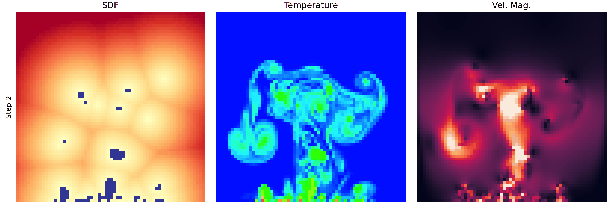

# Boiling Viz

A utility library to simplify making nice figures and animations. Checkout `example/example.py`.

```python
import numpy as np

from boiling_viz.fields import array_to_fields
from boiling_viz.boiling_video import BoilingVideoBuilder

data = np.load("example/slice.npy")
fields = array_to_fields(data)
builder = BoilingVideoBuilder(fields)
builder.make_video(
    path="example/sample.gif", 
    duration=1000 * (1 / 10), 
    colorbars=False, 
    step_counter=True, 
    field_titles=True
)
```



You can pass in lists of different fields defined in `boiling_viz.fields`, and implement
custom fields that derive from `FieldBase`.